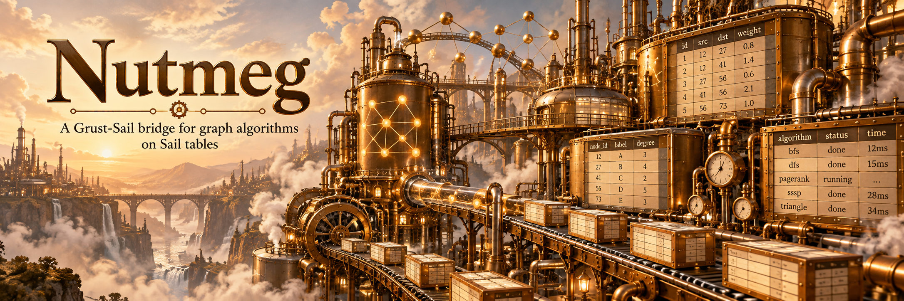

# Nutmeg 0.1.0: graph algorithms where the data already is



Neo4j's own tutorial, [Aura Graph Analytics with Spark](https://neo4j.com/docs/graph-data-science-client/current/tutorials/graph-analytics-serverless-spark/), is a clear and complete piece of documentation, and it is the reference this project follows step by step rather than a target. It takes a month of Citi Bike trips held in Spark, projects an edge list out of them, ships that edge list over Arrow Flight into a separate graph session, runs PageRank there, and streams the scores back into Spark. Every step is necessary given where the algorithm lives. The analysis itself is a function over an edge list.

Nutmeg removes the trip. It registers Grust's graph kernels inside Sail's Spark Connect server, so a PySpark client stages a graph from a DataFrame, calls an algorithm, and gets a DataFrame back — the edge list never crosses a process boundary, and neither do the results. There is no second system to provision, no credentials, no session lifetime, and no copy in a billed instance. Version 0.1.0 is the first release: a git tag rather than a crates.io publish, because `nutmeg-server` compiles Sail's crates into itself and [Sail does not publish to crates.io](https://github.com/lakehq/sail/issues/1991).

See the [release](https://github.com/querygraph/nutmeg/releases/tag/v0.1.0), the [repository](https://github.com/querygraph/nutmeg), the [Citi Bike example](https://github.com/querygraph/nutmeg/blob/main/examples/citibike/README.md), the [Grust repository](https://github.com/querygraph/grust) and the [Grust book](https://firstpair.org/read/grust/).

## What it is

Nutmeg serves whatever [Grust](https://github.com/querygraph/grust)'s procedure registry holds, through Grust's own runner. There is no per-kernel match arm in this repository, and a test fails when a registered kernel is not served. At Grust 0.23.0 that is 41 algorithms — PageRank and ArticleRank, Louvain and Leiden and label propagation, betweenness and closeness and harmonic and eigenvector and Katz and HITS, `A*` and Dijkstra and Yen's and Bellman–Ford, k-core, triangle counting, bridges, articulation points, spanning trees, max flow and min cut, FastRP, and the rest. A kernel Grust adds appears in Nutmeg by name with no change here.

Each is reachable two ways from a Spark client, with the same arguments, options and result columns:

```python
df = (spark.read.format("nutmeg")
      .option("graph", "bike_trips").option("algorithm", "pagerank").load())
```

```sql
SELECT * FROM nutmeg_pagerank('bike_trips')
```

The pieces underneath are Grust's, not new implementations. The catalog is `grust-algorithm-procedures`, the registry behind `CALL grust.algorithms.pagerank(...)`, and calls are validated by Grust's validator — a misspelled option is refused at planning with a message naming it. Projections are built by `GraphProjection::from_arrow_batches` with Grust's projection options, so node properties reach the kernels that need them: a community to score, a coordinate for `A*` to steer by, a weight column.

What Nutmeg owes on top of that is the behaviour a shared server needs.

**Row order is part of the input.** Grust's kernels are deterministic for a given input, but a DataFrame's row order is not fixed and Sail's scan order moves between runs. Staging therefore sorts every graph into a canonical order by default — nodes by id, edges by source, target, edge id, label and then every remaining column — after every write, including rows kept from earlier appends, so neither the order of the rows nor the order of the appends changes a result.

**One budget bounds the process.** `NUTMEG_MEMORY_BYTES` (8 GiB by default) limits the staged rows of every graph, each write's transient copies and its sort, every cached projection, and the kernels running on them — one Grust `ExecutionContext` whose reservations are taken before memory is allocated. A refused write leaves the graph exactly as it was.

**A read has limits of its own, when it asks for them.** `timeoutMs`, `workLimit`, `memoryLimitBytes` and `concurrency`, each on the read's own child execution, so one read's cancellation or deadline reaches nothing else. There is no default deadline or work limit, because a default would fail large legitimate reads on a busy machine and not on an idle one.

**Reads stream, and an interrupt reaches the kernel.** The kernel runs when the query executes, not while it is planned, on a thread of its own, sending batches through a bounded channel. `spark.interruptAll()`, `interruptTag`, `interruptOperation`, a satisfied `LIMIT` and `Query::cancel` all stop it. `SELECT * FROM nutmeg_reads()` lists what is running and the last 256 reads that ended.

**`precision`, new in Grust 0.23, reaches the schema.** `pagerank` and `articleRank` take `f64` (the default) or `f32`, and the `score` column's Spark type follows the declaration — `double` or `float` — because schema observation is now cached per value of `precision` rather than per algorithm.

## The Citi Bike run

The [example](https://github.com/querygraph/nutmeg/blob/main/examples/citibike/README.md) follows the tutorial's steps with the same file, the same projection and the same algorithm, then goes past its single algorithm. Every figure below was written by the script into `results/output.md` and `results/results.json` during the run recorded there; none was typed by hand.

A month of trips — 1595334 rows — is written to a Delta table in Sail. The tutorial's projection query is the same one: `SELECT start_station_id AS sourceNode, end_station_id AS targetNode FROM bike_trips`. Where the tutorial runs `mapInArrow` on each worker to push triplets to a remote Arrow Flight server and then waits for an import job, the example writes that DataFrame to `format("nutmeg")`. Sail executes the query and Nutmeg keeps the rows as a named in-memory graph in the same process. `projectionStats` reports 774 nodes, 1595334 arcs, 26234 self-loops and `csrBytes` 19147108.

PageRank converged in 55 iterations with a last L1 change of 9.69950689892e-09, and the read is itself a DataFrame: one SQL query calls `nutmeg_pagerank('bike_trips')` alongside the Delta table and joins the scores to station names and arrival counts. Nothing is exported at any point.

Nothing is trusted until it is checked against something that did not come from Grust. pandas reads the same CSV outside Sail, and the scores are computed twice more — by a NumPy/SciPy power iteration and by NetworkX 3.7 — with the dangling-mass and parallel-edge conventions matched deliberately:

| comparison | max abs diff |
|---|---|
| NetworkX vs the NumPy reference | 5.515e-14 |
| Nutmeg at the default tolerance vs NumPy | 4.841e-09 |
| Nutmeg at `tolerance` 1e-13 (114 iterations, converged) vs NumPy | 8.345e-14 |
| Nutmeg at the default vs a reference that *collapses* parallel edges | 4.210e-03 |

The first three agree in the top 10 and the top 50, in order. The default run's distance from the fixed point is bounded by its own stopping rule — a contraction of 0.85 puts it below 5.50e-08, and the observed L1 distance is 3.674e-08 — and at 1e-13 Nutmeg sits within 8.3e-14 of the reference, the same order as the gap between the two references. The last row is the control: collapsing parallel edges changes the top 10, which is how we know every trip is counted as its own edge.

Past the tutorial, in the same engine and the same process:

- **Leiden** on the trips as undirected unit edges, seed 42, found 8 communities in 3 levels, converged, with modularity 0.44082808748357094. NetworkX recomputed the modularity of that same partition from the CSV: 0.440828087484 against Nutmeg's 0.440828087484, difference 0.000e+00. The graph has no coordinates, so the map is a check rather than an input: mean distance from a station to its own community's centroid is 1861 m over 773 stations, against 4472 m mean and 4420 m smallest over 1000 shuffles of the labels with sizes kept — 0 shuffles at or below the observed value — and for 0.854 of stations the nearest centroid is their own community's.
- **Betweenness** on 70830 regularly ridden directed links from 760 source stations, weighted by median trip seconds, agrees with NetworkX's `betweenness_centrality` to 3.638e-12 over 761 nodes against a largest score of 28906.2, top 10 in the same order.
- **`A*`** from W 106 St & Central Park West to Atlantic Ave & Fort Greene Pl, with the great-circle heuristic and links weighted in metres, settled 78 stations and returned 12914.980413 m. Nutmeg's `dijkstra` returns 12914.980413 m, NetworkX's Dijkstra returns 12914.980413 m, largest pairwise difference 0.000e+00 m, and NetworkX's path is the same station sequence.
- **Written back**, one SQL query calling `nutmeg_pagerank(...)` and `nutmeg_betweenness(...)` beside the Delta tables wrote 774 rows of station metrics — both PageRanks, the community, the betweenness score — and read them back.

Three consecutive runs of that script produced the same `output.md` byte for byte and the same community map. `results.json`, which keeps full precision, differed only in the last digits of `mean_minutes_in`, a Sail SQL `AVG` that Nutmeg does not compute; every value Nutmeg returned was identical. Recapturing the example on Grust 0.23.0 left every Nutmeg-produced value unchanged from the previous capture, with one exception that is a real change in Grust 0.23: `csrBytes` for this graph fell from 25531544 to 19147108, the CSR being about a quarter smaller. That is a memory fact about the projection, not a timing.

## The two shapes, and how to choose

Grust reaches Sail two ways. They share no code, they are deployed differently, and choosing between them is the first decision rather than a detail.

**Nutmeg is the embedded shape.** `nutmeg-server` *is* the Sail Spark Connect server, with the data source and the table functions registered in every session. A staged graph is Arrow memory in that process and a kernel reads it in place. Only the result rows are produced at all; nothing goes over a wire. It needs one hook in Sail — a way for an embedder to choose the session factory, upstream as of [#2630](https://github.com/lakehq/sail/pull/2630) — and nothing graph-specific in Sail itself.

**`grust-sail` is the client shape, and it lives in Grust.** It is a Spark Connect client that links no Sail crate at all, speaks the same gRPC protocol PySpark speaks to a stock Sail server of any topology, and keeps a graph in two ordinary Delta tables. Two things about it are easy to overstate, so state them exactly:

- **It runs no graph kernel, and pushes none into Sail.** What it pushes down as SQL is degree aggregates, triplet joins, traversals lowered from Grust's traversal IR, and the pushable subset of read-only Cypher; variable-length paths are explicitly not pushed. To run PageRank, Leiden or anything else in `grust-algorithms` over Sail-held data you read the graph out — `read_graph`, `load_graph_arrow_ipc`, `query_arrow_ipc` — and run the kernel in your own process. There is no algorithm API on `grust-sail` today.
- **"Works against a cluster" is an argument, not a measurement.** The client holds one endpoint URL and sends ordinary Spark SQL and `LocalRelation` temp views, so none of the reasons Nutmeg fails in a cluster mode apply to it. But every configured `grust-sail` test and benchmark in Grust runs against a single-node `sail spark server`, and no `local-cluster` or `kubernetes-cluster` run of it is recorded. Treat its cluster support as unobstructed rather than verified.

So: **one machine, and you want the edge list not to move → embed Nutmeg.** **An existing Sail cluster, or a server you do not control → the client**, and pay the round trip, in exchange for a server that never has to know what a graph kernel is.

## What it does not do

**It does not work in Sail's cluster modes.** Not partially, not slowly — `local-cluster` and `kubernetes-cluster` fail, staging with `unsupported data sink node` and reads with `unsupported physical plan node` or `no graph named ...`. The mechanism, worked through in Grust's [`GRUST-SAIL.md` §7](https://github.com/querygraph/grust/blob/main/GRUST-SAIL.md), is threefold: a cluster-mode driver serialises every stage's physical plan through a hard-wired codec that refuses a node it does not know, `NutmegAlgorithmExec` and the stage writer's `DataSinkExec` included; stages are placed on workers except for a hard-coded driver list; and Nutmeg's staged graphs live in one process, so a Kubernetes worker running the stock `sail worker` binary has neither the code nor the graph. Letting an embedder serialise its own nodes would move the failure from the codec to the worker rather than remove it. A correct fix needs two seams Sail does not offer — driver placement for an embedder's node, and a driver-side codec for it — and no Sail change is proposed for this. `nutmeg-server` selects materialised reads in the cluster modes because that is what can be encoded; it does not make staging work there.

**Staged graphs are process memory.** They are gone when the server restarts, and one machine's memory is the ceiling for everything staged at once. The client shape is the one whose graphs are tables that survive.

**The hook it is built on is regarded as unstable by Sail's maintainer**, who has said the session mutator is "a deep implementation detail" and that a future extension API would go through DataFusion's FFI rather than a Rust trait. Nutmeg's long-term path is that API if and when it exists.

## What the kernels bring

The alternative to embedding kernels is bolting a graph engine onto a query engine, and the difference shows up in three properties that are hard to add afterwards.

**Results are bit-identical at any worker count**, including floating-point residuals and charged work, because Grust's parallel kernels partition by the input rather than by the worker count and combine partials in index order.

**Parity against an independent reference comes before trust.** The kernels are oracle-checked in Grust, and the example above repeats the exercise end to end against NumPy, NetworkX and a deliberately wrong control — which is why the parallel-edge row is in the table.

**Admission control is a property of the server, not a wrapper around it.** Deadlines, work budgets, memory limits and cancellation are charged and admitted inside the kernels, which is what lets a shared Sail process hand an untrusted caller an algorithm without handing it the machine. Grust 0.23's block charging made that default mode much cheaper to have on; the measurement is the benchmark's job, published at [adversari.al/graph/kernels](https://adversari.al/graph/kernels) with its evidence bundle in `querygraph/adversarial-graph-algorithms`, and this page does not restate its numbers.

## Getting it

Nutmeg is released as a git tag: clone [the repository](https://github.com/querygraph/nutmeg) at [`v0.1.0`](https://github.com/querygraph/nutmeg/releases/tag/v0.1.0), `cargo build --release -p nutmeg-server`, and point a `pyspark-client` at it. Grust and Sail are both pinned in the workspace manifest — crates.io 0.23.0 and a `lakehq/sail` revision — so a clean clone builds with no sibling checkouts. `examples/citibike/run.sh` runs the whole example above, downloads included.
