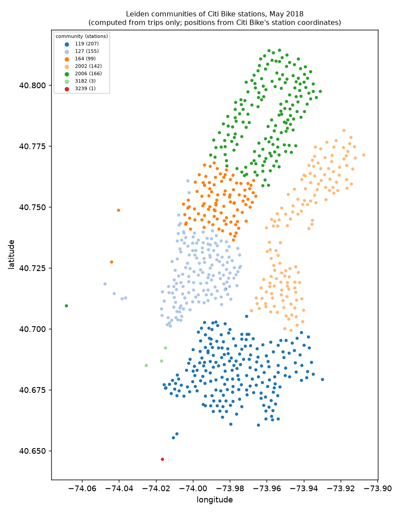

# Citi Bike trips in Sail, analysed with Nutmeg

This example follows Neo4j's tutorial
[Aura Graph Analytics with Spark][tutorial] step by step, using the same
bike-trip file, the same projection, the same algorithm and the same result
shape. It then goes past the tutorial's single algorithm. The trips are
stored in a Sail Delta table. Nutmeg runs Grust's graph kernels inside the
Sail server process, and the results come back as ordinary DataFrames and
SQL table functions.

The page states facts about where the data is kept, what moves and what each
step needs. It makes no claims about speed, which is the benchmark's job
and is measured separately. Every number below comes from
[`results/output.md`](results/output.md). `citibike.py` wrote that file
during the run recorded there, and nothing below was typed in by hand.

- `citibike.py` downloads the data, builds the tables, runs every step and
  every reference check, and writes `results/`.
- `run.sh` starts a built `nutmeg-server`, records the component versions,
  runs the script and stops the server.
- `results/output.md` is the captured output of the run, and
  `results/results.json` holds the same numbers as data.
- `results/communities.png` is the community map. `results/rerun-diff.txt`
  compares three consecutive runs of the captured script.

## Versions of the captured run

| component | version |
|---|---|
| grust commit | ca6890053fba0e1bb1b7581d876dd0a1d1ad7285 (`querygraph/grust` main; recorded in `GRUST_COMMIT`) |
| nutmeg commit | 0480123994b67f32dc41c01d58aa914c8877fd3e (`integration/nutmeg-0.1`, the integrated head; these results are committed on top of it) |
| sail commit | f1cf1729b1d083f2b97f1ce6e68a0d92c5ccee8f (upstream `lakehq/sail` main, which contains the session-factory hook from #2630; recorded in `SAIL_COMMIT`) |
| pyspark (client) | 4.2.0 (`pyspark-client`) |
| server Spark version (spark.version) | 4.2.0 |
| python (client) | 3.13.5 |
| rustc | rustc 1.98.1 (48a229cea 2026-09-01) |
| host | Linux 6.12.107+deb13-cloud-amd64 x86_64 |

## Running it

Grust and Sail are pinned in the workspace manifest — crates.io `0.23.0` and
a `lakehq/sail` revision — so a clean clone needs no sibling checkouts, and
this run's components are exactly the pins above.

```sh
cargo build --release -p nutmeg-server          # Sail is a large build; cap its memory and jobs
python3 -m venv .venv && .venv/bin/pip install "pyspark-client==4.2.0" "pandas<3" pyarrow numpy scipy networkx matplotlib
NUTMEG_SERVER=$PWD/target/release/nutmeg-server WORK=/abs/work/dir PYTHON=$PWD/.venv/bin/python \
  examples/citibike/run.sh
```

`WORK` must be a directory the server can read and write. The server reads
the CSV files from it and writes its Delta tables under `WORK/delta`, which
`run.sh` clears at the start of each run. The script downloads the
[Kaggle file][kaggle] (40 MB zip) and
[Citi Bike's 2018 archive][citibike-zip] (1.34 GB zip) into `WORK/data`.
Neither dataset is committed here. The Sail server embeds Python and imports
`pyspark` in its own process, so `run.sh` gives it the client environment's
`site-packages`.

## Where the data is, what moves, what is needed

Neo4j documents two routes from Spark data to graph algorithms:

- **GDS on a Neo4j database, loaded through the
  [Neo4j Connector for Apache Spark][spark-connector].** The connector
  "provides integration between Neo4j and Apache Spark" and writes
  DataFrames to Neo4j, where GDS projects the graph and runs its algorithms.
- **Aura Graph Analytics**, the route the [tutorial][tutorial] takes.

The table below sets the tutorial's steps next to this example's. Everything
in the left column comes from the tutorial page.

| | Neo4j tutorial ([source][tutorial]) | This example |
|---|---|---|
| Setup | `graphdatascience>=2.0a1` and `pyspark`. `AuraAPICredentials(client_id, client_secret, project_id)` builds `GdsSessions` | A running `nutmeg-server`, which is Sail's Spark Connect server with Nutmeg registered, and a Spark Connect client (`pyspark-client`). This run used no credentials: the server listens on 127.0.0.1 |
| Compute for the algorithms | `sessions.get_or_create(session_name="bike_trips", memory=SessionMemory.m_2GB, ttl=timedelta(minutes=30), cloud_location=CloudLocation("gcp", "europe-west1"))`, a separate session in GCP europe-west1 | The Sail server process that holds the tables |
| Load the data | `spark.read.csv(download_path, header=True, inferSchema=True)` into a temp view `bike_trips` | The same CSV written to a Delta table `bike_trips` with `gender` and `age` dropped (Step 1) |
| Projection | `SELECT start_station_id AS sourceNode, end_station_id AS targetNode FROM bike_trips` | The same query |
| Move the graph to the algorithms | `arrow_client.create_graph_from_triplets`, then `mapInArrow` runs `upload_triplets` on each Spark worker to send its batches to the session's Arrow Flight server, then `triplet_load_done`, then a wait for the import job | `df.write.format("nutmeg").option("graph", "bike_trips").option("part", "edges")`. Sail executes the query and Nutmeg keeps the rows as a named in-memory graph **inside the same server process** |
| Algorithm | `gds.page_rank.mutate(G, mutate_property="pagerank")` | `spark.read.format("nutmeg").option("graph", "bike_trips").option("algorithm", "pagerank")`, or `nutmeg_pagerank('bike_trips')` in SQL |
| Results back | `arrow_client.get_node_properties`, then `mapInArrow` over `spark.range(defaultParallelism)` to stream the scores from the session into Spark as `nodeId long, pagerank double` | The read is itself a DataFrame. `CAST(nodeId AS BIGINT) AS nodeId, score AS pagerank` gives the tutorial's shape |
| Use the results | `result.toPandas()` | One SQL query joins the scores to station names in the same engine (Step 4) |
| Clean up | `gds.delete()` "will release all resources associated with it, and stop incurring costs" | Overwrite the staged graph with nothing, or stop the server |

What the right-hand column does *not* include: no second system, no network
transfer of the edges or of the results to another service, no credentials
and no session lifetime. The one copy is inside the Sail process. Staging
copies the projected rows into Nutmeg's in-memory graph registry, and the
kernels build their CSR from that copy. For the tutorial's graph this run
reports `csrBytes` = 25531544 (Step 2). This run used a single local Sail
server. Where staging happens when Sail runs distributed has not been
checked here.

This example does not run the Neo4j side, so the tutorial's numbers are not
reproduced. They would not be on the same scale anyway. The GDS PageRank
page (<https://neo4j.com/docs/graph-data-science/current/algorithms/page-rank/>)
says "the returned scores are not normalized", and its defaults are
`maxIterations` 20 and `tolerance` 0.0000001. Grust's PageRank scores sum to
1, and its defaults are 1000 iterations and a tolerance of 1e-8 on the L1
change.

## Part 1: the tutorial, step by step

**Step 1: CSV to Delta.** The file has 1595334 rows and the columns
`start_time, stop_time, start_station_id, start_station_name, end_station_id,
end_station_name, user_type, bike_id, gender, age, trip_duration`. `gender`
and `age` are dropped before the write. A station graph needs neither, and
neither exists in any Sail table this example writes.

The tutorial's `inferSchema=True` failed in this Sail build with
`cast Timestamp(Second, None) to Spark data type`. The script reports that
failure and then gives the same eleven columns explicitly.

**Step 2: stage the projection.** `projectionStats` on the staged graph:

| nodes | edges | arcs | selfLoops | csrBytes |
|---|---|---|---|---|
| 774 | 1595334 | 1595334 | 26234 | 25531544 |

**Step 3: PageRank.** It converged in 55 iterations, with a last L1 change
of 9.69950689892e-09 and scores summing to 1 over 774 nodes. The result
schema, cast to the tutorial's shape, is
`struct<nodeId:bigint,pagerank:double>`.

**Step 4: scores joined to names in one SQL query.** The PageRank table
function, the station-name lookup and the arrival counts all come from one
query over the Delta table. Nothing is exported:

```sql
WITH stations AS (...), arrivals AS (...)
SELECT s.station_name, CAST(pr.nodeId AS BIGINT) AS nodeId, pr.score AS pagerank, a.trips_in
FROM nutmeg_pagerank('bike_trips') AS pr
JOIN stations AS s ON s.station_id = CAST(pr.nodeId AS BIGINT)
JOIN arrivals AS a ON a.station_id = s.station_id
ORDER BY pagerank DESC LIMIT 10
```

| station_name | nodeId | pagerank | trips_in |
|---|---|---|---|
| Pershing Square North | 519 | 0.00670061 | 15524 |
| W 21 St & 6 Ave | 435 | 0.00488794 | 11459 |
| Broadway & E 22 St | 402 | 0.00487227 | 11060 |
| W 33 St & 7 Ave | 492 | 0.00478865 | 10762 |
| West St & Chambers St | 426 | 0.00471145 | 10695 |
| E 17 St & Broadway | 497 | 0.00432707 | 9905 |
| W 41 St & 8 Ave | 477 | 0.00410699 | 9426 |
| Broadway & E 14 St | 285 | 0.00391052 | 8896 |
| W 22 St & 10 Ave | 462 | 0.00390759 | 9176 |
| W 31 St & 7 Ave | 379 | 0.00370799 | 8640 |

### Checking PageRank against an independent reference

The reference does not go through Sail or Nutmeg. pandas reads the CSV
itself, and the scores are computed twice: once by a NumPy/SciPy power
iteration written in `citibike.py`, and once by NetworkX 3.7's `pagerank`.

**Dangling stations.** Eight stations have arrivals but no departures, so
they have no outgoing edges: Heights Elevator, Hamilton Park, Van Vorst
Park, Essex Light Rail, NYCBS DEPOT - DELANCEY, Morris Canal, Marin Light
Rail and JCBS Depot. Their trips in are listed in the output. Grust spreads
a dangling node's score uniformly over all nodes
(`grust-algorithms/src/pagerank.rs`). The NumPy reference does the same
explicitly. NetworkX does it by default, because it sends dangling mass to
the personalization vector, which is uniform when none is given.

**Parallel edges.** The 1595334 trips connect 177168 distinct ordered
station pairs, and 26234 trips start and end at the same station. Grust
counts every trip as its own edge ("Parallel edges contribute
independently"), so a station passes its score to each destination in
proportion to the number of trips there. Both references do the same by
summing the parallel edges into a trip count per pair.

The tutorial uploads one triplet per row. GDS's projection documentation
says "By default, GDS preserves parallel relationships"
(<https://neo4j.com/docs/graph-data-science/current/management-ops/graph-creation/graph-project/>),
which matches counting every trip. The tutorial page does not say whether
the Arrow triplet import keeps or merges them. That was not checked here and
is **unsure**.

Observed agreement, over all 774 stations:

| comparison | max abs diff | L1 diff | max rel diff | top 10 order | top 50 order |
|---|---|---|---|---|---|
| NetworkX vs NumPy reference | 5.515e-14 | 2.866e-13 | 3.995e-11 | same | same |
| Nutmeg, default tolerance (stops at L1 change ≤ 1e-8) vs NumPy | 4.841e-09 | 3.674e-08 | 3.507e-06 | same | same |
| Nutmeg, `tolerance` 1e-13 (114 iterations, converged) vs NumPy | 8.345e-14 | 4.404e-13 | 6.045e-11 | same | same |
| Nutmeg, default, vs a reference that **collapses** parallel edges | 4.210e-03 | 2.634e-01 | 3.064e+00 | differs | differs |

What these results show:

- The NumPy reference ran until its L1 change was below 1e-14. It stopped
  after 127 iterations with a last change of 8.784e-15.
- **The default run agrees with the reference within the error its stopping
  rule allows.** Each PageRank step is a contraction with factor 0.85 in L1.
  So a last L1 change of 9.6995e-09 bounds the L1 distance to the fixed point
  by 0.85 / 0.15 × 9.6995e-09 ≈ 5.50e-08. The observed distance is
  3.674e-08.
- At `tolerance` 1e-13, Nutmeg and the NumPy reference agree to 8.3e-14 per
  score. That is the same order as the gap between the two references
  themselves (5.5e-14). **The scores are not bit-identical** to the
  reference. They are identical from run to run: three consecutive runs of
  the captured script printed the same digits everywhere in this section
  (`results/rerun-diff.txt`). Before Nutmeg kept staged graphs in a
  canonical order, the last digits of these differences and of the last L1
  change moved between consecutive runs (9.69951240834e-09 in one run,
  9.6995114111e-09 in the next). The likely cause is that edge order fixes
  the order of PageRank's floating-point sums; that was inferred from the
  change, not traced in the kernel.
- Against the collapsed reference, the top 10 differs. This confirms that
  Nutmeg counts parallel edges.

## Part 2: further, in the same engine

### Station coordinates: verified

The Kaggle file has no coordinates. Citi Bike's own May 2018 file, taken
from the yearly archive, has the header `tripduration, starttime, stoptime,
start station id, start station name, start station latitude, start station
longitude, end station id, end station name, end station latitude, end
station longitude, bikeid, usertype, birth year, gender`.

The script checks this header before it uses the file, and reads only the
station columns into Delta (`station_coordinates`). All 774 stations have
coordinates, and none has more than one position in the month. One of them
lies outside New York: `3650 8D Mobile 01` at 45.506264, -73.568906. It is
left out of the geographic analyses. That leaves 773 stations.

### PageRank weighted by trip duration

Trips longer than 180 minutes are left out: 2025 trips, the longest
111782 minutes. A bike not docked for days measures no trip's travel time.
`trip_duration` is then staged as an edge column and passed as
`weightProperty`.

What the weight means: in weighted PageRank a station passes its score to
its destinations in proportion to the edge weights, divided by the total
weight of its outgoing edges. With durations summed over parallel trips, a
station passes its score **in proportion to the minutes ridden to each
destination, not the number of trips**. A destination rises when the trips
into it are long, and falls when it mostly receives short hops. The score
still measures reachability by riding. It does not measure travel time
itself: a short trip counts for less, not for more.

Top 10 by minutes, with the rank by trip count on the same trips:

| station_name | rank_by_minutes | rank_by_trips | trips_in | mean_minutes_in |
|---|---|---|---|---|
| Pershing Square North | 1 | 1 | 15517 | 12.8334 |
| West St & Chambers St | 2 | 5 | 10688 | 17.9943 |
| Broadway & E 22 St | 3 | 3 | 11056 | 12.1477 |
| 12 Ave & W 40 St | 4 | 21 | 7035 | 19.9475 |
| W 33 St & 7 Ave | 5 | 4 | 10755 | 12.1166 |
| W 21 St & 6 Ave | 6 | 2 | 11452 | 11.4773 |
| W 22 St & 10 Ave | 7 | 9 | 9165 | 14.0744 |
| W 41 St & 8 Ave | 8 | 7 | 9424 | 12.6787 |
| E 17 St & Broadway | 9 | 6 | 9899 | 11.3063 |
| South End Ave & Liberty St | 10 | 23 | 6856 | 17.0642 |

Among stations with at least 1000 arrivals, the largest rises are Riverside
Drive stations (W 104 St: rank 534 → 290, mean arriving trip 25.1 min; W 78
St: 522 → 289; W 91 St: 596 → 372). Bus Slip & State St and Cherry St also
rise. The largest falls are stations whose trips in are short hops:
31 St & Broadway (134 → 356, 9.7 min), Macon St & Nostrand Ave
(257 → 466, 8.2 min), N 8 St & Driggs Ave (51 → 218, 8.5 min). Across all
stations, the correlation between a station's mean arriving trip length and
its rise in rank is 0.536. Waterfront and park-edge destinations reached by
long rides gain, and neighbourhood stations served by short hops lose.

**Reference check.** The NumPy reference ran on the CSV with durations
summed per pair (116 iterations, last L1 change 9.195e-15). Over 772
stations it agrees with Nutmeg's default run to a max abs diff of 7.640e-09
and an L1 diff of 3.899e-08. The top 10 and top 50 are in the same order.
Two stations drop out of this graph because all their trips are over 180
minutes.

### Station communities (Leiden)

Leiden ran on the tutorial's trips, each trip an undirected edge of
weight 1, with `seed` 42, on the graph from Step 2 as staged. It found
**8 communities with modularity 0.440828087**, in 3 levels, and converged.
The result was written to `delta/station_communities`.

**Reference check.** NetworkX recomputed the modularity of Nutmeg's
partition from the CSV's trips: 0.440828087484. Nutmeg reports
0.440828087484, and the printed difference is 0.000e+00.

**Reproducibility.** Leiden visits nodes in projection row order, shuffled
by the seed, and the row order follows the order in which rows are staged.
Sail's scan of the Delta table does not keep that order fixed from run to
run: during development, two runs of the same unsorted staging gave
modularity 0.439815435 and 0.438930183. Nutmeg now sorts every staged graph
into a canonical order by default (the `order` write option; see the
top-level README), and the script stages the trips once, with no sort of
its own. Three consecutive runs of the captured script gave the same
`output.md` byte for byte and the same community map
(`results/rerun-diff.txt`). `results.json` keeps full precision, and there
the runs differ only in the last one or two digits of `mean_minutes_in`
and of the correlation computed from it. Those means are Sail SQL `AVG`s
over the trips, which Nutmeg does not compute; every value Nutmeg returned
was identical.

The partition is not the one an earlier version of this page reported.
That run staged the trips a second time, sorted by station id **as a
number**, and found 8 communities with modularity 0.441135661. Canonical
order compares ids as text (`"10"` before `"9"`), so Leiden visits the nodes
in a different order and finds a different partition of almost the same
quality. Checked on this build, outside the captured run: staging the trips
sorted numerically with `order` = `asStaged` gives 0.441135661455 again, and
staging them in descending order with the default canonical order gives the
captured partition exactly. Between the two partitions, 10 of 774 stations
change community: 8 move from the downtown community to the midtown one
(among them W 21 St & 6 Ave, which was downtown's highest-PageRank
station), 1 from the uptown community to midtown and 1 from midtown to
downtown. The other communities have the same members.

**Geographic check.** Trips are the only input to the graph, which has no
coordinates. If the communities are real, stations close together should
land in the same community:

- The mean distance from a station to its own community's centroid is
  **1861 m** over 773 stations.
- In 1000 shuffles of the community labels among stations, with community
  sizes kept, the mean distance is 4472 m and the smallest is 4420 m. None
  of the 1000 shuffles comes as close as the real partition.
- For 0.854 of the stations, the nearest community centroid is their own
  community's.



| community | stations | centroid | highest-PageRank station |
|---|---|---|---|
| 119 | 207 | 40.6828, -73.9768 | Hanson Pl & Ashland Pl |
| 2006 | 166 | 40.7871, -73.9599 | Broadway & W 60 St |
| 127 | 155 | 40.7231, -73.9977 | Broadway & E 22 St |
| 2002 | 142 | 40.7406, -73.9414 | Metropolitan Ave & Bedford Ave |
| 164 | 99 | 40.7520, -73.9865 | Pershing Square North |
| 3182 | 3 | 40.6881, -74.0191 | Soissons Landing |
| 3239 | 1 | 40.6465, -74.0166 | Bressler |

On the map, community 119 covers the Brooklyn stations south of about
40.716 N. Community 2002 runs from Williamsburg and Greenpoint up through
Long Island City and Astoria, on both sides of Newtown Creek. The Manhattan
stations split into three latitude bands: downtown (127), midtown (164) and
the Upper West and Upper East Sides together (2006), with Central Park
between those last two. The three Governors Island stations (3182) are a
community of their own.

The eighth community (3650) has no row in the table because it contains
only the out-of-town mobile station. The seven points west of -74.03 are the
Jersey City stations from the dangling list in Part 1. In this file each one
only receives trips, one to three apiece. They fall into Manhattan
communities, which is what those few trips imply: four into 127, two into
164 and one into 2006, as read from this run's `delta/station_metrics`.

### Betweenness: hub stations on the quickest routes

Betweenness ran on directed links ridden at least 5 times in the month,
self-trips excluded: 70830 links from 760 source stations. Each link is
weighted by its median trip time in whole seconds, from 68 to 7416.
Integral weights make Dijkstra's ties exact, and Grust documents that tied
costs are compared as `f64`. The link table is written to
`delta/station_links` and staged from there.

| station_name | betweenness | community |
|---|---|---|
| Queens Plaza North & Crescent St | 28906.2 | 2002 |
| Schermerhorn St & Bond St | 18167.3 | 119 |
| W 43 St & 6 Ave | 15928.2 | 164 |
| 45 Rd & 11 St | 15518.1 | 2002 |
| Broadway & W 41 St | 14820.8 | 164 |
| Lawrence St & Willoughby St | 14538.7 | 119 |
| Hanson Pl & Ashland Pl | 12531.7 | 119 |
| Broadway & E 22 St | 12400 | 127 |
| N 6 St & Bedford Ave | 12243.5 | 2002 |
| 1 Ave & E 62 St | 12187.3 | 2006 |

The top station, Queens Plaza North & Crescent St, sits at the Queens end of
the Queensboro Bridge, and 45 Rd & 11 St is nearby in Long Island City.
Schermerhorn St & Bond St and Lawrence St & Willoughby St are in Downtown
Brooklyn. The quickest routes between neighbourhoods run through these
stations far more often than their PageRank suggests: Queens Plaza North is
54th by PageRank and Schermerhorn St is 223rd.

**Reference check.** NetworkX's `betweenness_centrality(weight=...,
normalized=False)` ran on the same link table, read back from Delta. Over
761 nodes the largest abs diff was 3.638e-12, with a largest score of
28906.2, and the top 10 are in the same order. It is not an exact match.
The three runs in `results/rerun-diff.txt` all printed 3.638e-12; three
earlier runs, made before canonical order, printed 1.819e-12, 3.638e-12 and
5.457e-12.

### Results written back to Delta, joined to names

One SQL query joined the station names, coordinates, both PageRanks, the
community and the betweenness score. It wrote 774 rows to
`delta/station_metrics`. It calls `nutmeg_pagerank(...)` and
`nutmeg_betweenness(...)` as table functions alongside the Delta tables.
Stations absent from the link graph have a NULL betweenness. Read back in
one query:

| station_name | community | betweenness | pagerank_rank | minutes_rank |
|---|---|---|---|---|
| Queens Plaza North & Crescent St | 2002 | 28906.2 | 54 | 72 |
| Schermerhorn St & Bond St | 119 | 18167.3 | 223 | 303 |
| W 43 St & 6 Ave | 164 | 15928.2 | 138 | 121 |
| 45 Rd & 11 St | 2002 | 15518.1 | 364 | 405 |
| Broadway & W 41 St | 164 | 14820.8 | 19 | 18 |

### A* between two named stations

The route runs from **W 106 St & Central Park West** to **Atlantic Ave &
Fort Greene Pl**. It uses the same regularly ridden links (at least 5 trips)
between stations inside the NYC box: 761 nodes and 70830 edges. Each link is
weighted by the great-circle length between its two stations in metres,
computed in SQL with the Earth radius the Grust kernel uses.

Grust's A* heuristic is the great-circle distance to the target. Grust
documents it as admissible only when the weights are distances in metres,
so this example measures links in metres and not in minutes.

| hop | station | metres from start |
|---|---|---|
| 0 | W 106 St & Central Park West | 0 |
| 1 | Pershing Square North | 5348 |
| 2 | Atlantic Ave & Fort Greene Pl | 12915 |

The route covers 12915.0 m over 2 links, against a straight line of
12785.1 m, and the search settled 78 stations. The route is short in hops
because Pershing Square North has regular links to much of the network.

The route graph is staged straight from the two SQL queries that build it,
each of which joins the link table to the station coordinates; nothing is
written to Delta first. Nutmeg's `dijkstra` from the start station reads 4
stations as unreachable, with a NULL distance.

**Reference check.** The A* total of 12914.980413 m equals Nutmeg's
`dijkstra` and NetworkX's `dijkstra_path_length` on the same
edges; the largest pairwise difference printed is 0.000e+00 m. NetworkX's
path is the same sequence of stations.

## What did not work, as observed in this run

- **`inferSchema=True` on the Kaggle CSV** fails in Sail `f1cf1729` with
  `cast Timestamp(Second, None) to Spark data type`. The script gives the
  schema explicitly.
- During development, and not in the captured run, overwriting an existing
  Delta table from a query with a `LEFT JOIN` to a Nutmeg table function
  failed with `DELTA_NOT_NULL_CONSTRAINT_VIOLATED`, and an earlier
  `COALESCE(score, 0.0)` came back as `decimal(30,15)`. `run.sh` now starts
  from an empty `WORK/delta`, and the query no longer coalesces. The cause
  of either error is **unsure**.

## Data and licences

- **Trips:** Kaggle dataset
  [`gabrielramos87/bike-trips`][kaggle], "New York Citibike Trips for One
  Month", May 2018. The uploader labels it CC0, and it is sourced from
  BigQuery's public Citi Bike data. It is downloaded from
  `https://www.kaggle.com/api/v1/datasets/download/gabrielramos87/bike-trips`,
  the URL the tutorial uses. An anonymous GET works; a HEAD answers 404.
- **Station coordinates:** Citi Bike's trip history, file
  `2018-citibike-tripdata/201805-citibike-tripdata.csv` in
  [`2018-citibike-tripdata.zip`][citibike-zip].
- The underlying trip data is Citi Bike's and is used under the
  [Citi Bike Data License Agreement][citibike-licence] of Lyft Bikes and
  Scooters, LLC ("Bikeshare"). This example is not affiliated with,
  endorsed by or sponsored by Citi Bike, Bikeshare or Lyft. As that licence
  requires, the data is not redistributed here: the script downloads it
  from the sources above.
- The Neo4j tutorial is quoted and cited for its own steps. Neo4j, GDS and
  Aura are Neo4j's products and are described here only as their
  documentation describes them.

[tutorial]: https://neo4j.com/docs/graph-data-science-client/current/tutorials/graph-analytics-serverless-spark/
[spark-connector]: https://neo4j.com/docs/spark/current/
[kaggle]: https://www.kaggle.com/datasets/gabrielramos87/bike-trips
[citibike-zip]: https://s3.amazonaws.com/tripdata/2018-citibike-tripdata.zip
[citibike-licence]: https://citibikenyc.com/data-sharing-policy
